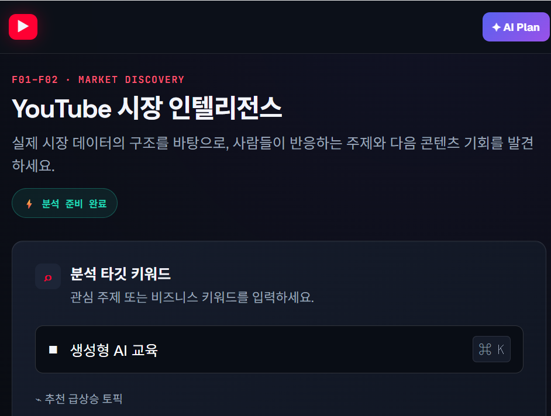
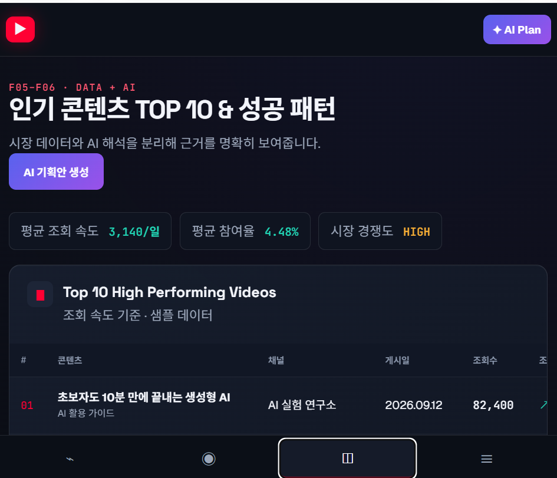

<p align="center">
  
  
</p>

# TubePlanner AI

YouTube 시장 데이터를 분석해 인기 콘텐츠의 성공 패턴을 찾고, 데이터 근거가 연결된 신규 콘텐츠 기획안을 제안하는 반응형 웹 애플리케이션입니다.

> 현재 버전은 API 키 없이 전체 사용자 흐름을 확인할 수 있는 샘플 데이터 기반 MVP입니다.

## 라이브 데모

[TubePlanner AI 실행하기](https://tubeplanner-ai-studio.thinkingdesigner.chatgpt.site)

## 이번 작업의 주요 내용

### 1. 4단계 콘텐츠 기획 흐름 구현

1. 키워드, 분석 기간, 영상 수 입력
2. 시장 규모와 주제별 점유율 확인
3. 인기 콘텐츠 TOP 10과 성공 패턴 분석
4. 콘텐츠 유형별 AI 기획안 생성 및 재생성

### 2. 시장 데이터와 AI 제안 분리

- 조회수, 일평균 조회 속도, 참여율 등 정량 지표 제공
- 반복 주제, 검증된 제목 공식, 콘텐츠 갭 등 AI 해석을 별도 영역에 표시
- 각 콘텐츠 기획안에 타깃 시청자와 추천 근거를 함께 제공

### 3. 콘텐츠 기획 스튜디오

- 정보형, 교육형, 리뷰형, 비교형, 튜토리얼, Shorts 필터 제공
- 예상 관심 점수, 타깃 시청자, 데이터 분석 근거 제공
- 대표 기획안에는 단계별 영상 구성안을 함께 표시
- 선택한 유형을 기준으로 기획안을 다시 생성하는 상호작용 구현

### 4. UI 및 반응형 디자인

- 첨부 UI의 다크 분석 워크벤치 디자인 반영
- YouTube 데이터는 레드, AI 분석은 퍼플, 성과 지표는 시안 컬러로 구분
- 데스크톱 사이드바를 모바일 하단 내비게이션으로 전환
- 긴 테이블은 작은 화면에서 가로 스크롤이 가능하도록 처리
- 모바일과 데스크톱에서 동일한 분석 흐름 유지

## 주요 오류 수정 및 안정화

- 분석 버튼 클릭 후 결과 화면으로 이동하지 않던 흐름을 로딩 상태와 단계 전환 로직으로 연결했습니다.
- 메뉴마다 활성 상태가 일치하지 않던 문제를 공통 화면 전환 함수로 정리했습니다.
- 키워드 추천 칩 선택 시 입력값이 반영되지 않던 문제를 이벤트 위임 방식으로 수정했습니다.
- 기간·영상 수 선택 항목에서 여러 버튼이 동시에 활성화될 수 있던 문제를 단일 선택 방식으로 보정했습니다.
- 모바일에서 분석 테이블과 카드가 화면 밖으로 잘리는 문제를 반응형 그리드와 스크롤 컨테이너로 수정했습니다.
- 콘텐츠 유형 필터 변경 후 대표 기획안과 하위 카드가 함께 갱신되도록 렌더링 로직을 통합했습니다.
- 외부 API 키가 프런트엔드에 노출되지 않도록 현재 버전은 샘플 데이터 모드로 구성했습니다.
- 네트워크 연결 없이도 핵심 사용자 흐름을 확인할 수 있도록 데모 데이터와 상태 메시지를 추가했습니다.

## 기술 구성

- HTML5
- CSS3
- Vanilla JavaScript
- 정적 사이트 배포

별도 패키지 설치나 빌드 과정 없이 실행할 수 있습니다.

## 로컬 실행

```bash
python -m http.server 4173 --directory dist
```

브라우저에서 `http://localhost:4173`으로 접속합니다.

## 프로젝트 구조

```text
.
├─ .openai/
│  └─ hosting.json
├─ dist/
│  ├─ index.html
│  ├─ styles.css
│  └─ app.js
├─ docs/
│  └─ images/
│     ├─ tubeplanner-market-intelligence.png
│     └─ tubeplanner-top10-patterns.png
└─ README.md
```

## 실제 API 연동 시 필요한 작업

현재 MVP를 실제 데이터 기반 서비스로 확장하려면 다음 작업이 필요합니다.

- 서버 측 YouTube Data API v3 연동
- 조회 속도와 참여율 계산 API 구현
- LLM 구조화 출력 및 콘텐츠 기획 생성 API 구현
- 동일 검색 조건에 대한 캐시 적용
- API 키를 서버 환경변수로 관리

프런트엔드 코드에 YouTube 또는 LLM API 키를 직접 저장하지 마세요.

## 현재 제한 사항

- 표시되는 영상, 지표, 기획안은 UX 검증용 샘플 데이터입니다.
- 콘텐츠 재생성은 서버 AI 호출을 모사한 데모 동작입니다.
- 로그인, 결과 저장, 댓글 VOC 분석, 보고서 내보내기는 후속 범위입니다.
